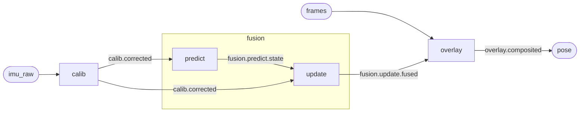

# dfg

A dataflow graph framework usable across real-time and batch or offline processing.
Intended to be embedded within larger applications used to record and process data, both
in small batches and on large-scale columnar datasets. Example data will be from sampled
sensors like an IMU, audio, and video.

We will implement this in several languages as a learning exercise into the tradeoffs
between them. Eventually we will probably write it in a native core with multiple
language bindings. The goal is to have a portable core which can be used across laptop,
server, mobile, and embedded (microcontroller) devices.

This document is the contract. It is written before any port exists so that the ports
have something to agree with, and it states the alternatives it rejects rather than only
the choices it makes.

## Requirements

### Structure

1. **Nodes compute.** A node performs some computation on named inputs and produces
   named outputs. It is initialized with parameters and may maintain its own state.
2. **Graphs compose nodes.** Nodes and the edges between them form a directed acyclic
   graph. Like a node, a graph has inputs, outputs, and parameters — which is what lets a
   graph be referenced as a node inside a higher-level graph.
3. **Every instance has a unique, human-readable name.** Node IDs and port names are
   chosen by the author, not generated. A node inside a subgraph is namespaced by the
   enclosing graph's ID.
4. **Everything flowing through the graph is addressable as a topic.** A topic name is
   derived from the producing node's qualified ID and output port name. An explicit graph
   output name is an *alias* of the connected node's output, not a separate topic.

### Execution

5. **The blueprint is separate from the instance.** A blueprint describes a graph: node
   types, parameters, connections, and policies. It is cheap to build, serializable,
   validatable, and renderable as graphviz or mermaid. Instantiating it produces a
   runnable graph that can actually process data. The two layers never merge.
6. **Nodes have a three-call lifecycle.** `setup` runs exactly once before the first
   `run`; `run` consumes inputs and produces outputs; `teardown` runs exactly once after
   the last `run`.
7. **Scheduling is a policy, and it is two axes, not one.** A per-node *readiness rule*
   decides when a node may fire; a scheduler *ordering* decides which of the ready nodes
   fires next. Both are extensible. See [Scheduling](#scheduling). **Real-time and batch
   are the same runtime** with different schedulers and chunk sizes — a batch is a very
   large sample — rather than two engines behind one API. One node contract, one set of
   semantics to test. See [Tensions](#tensions) for what that bet costs.
8. **Execution is deterministic.** The same blueprint plus the same injected sequence
   produces the same outputs. This is what makes offline reprocessing of a recording
   trustworthy, and it constrains every scheduler added later.

### Interfaces

9. **The application drives the graph through an in-memory API.** It injects data into
   graph inputs and retrieves data from graph outputs, by polling or by callback.
10. **Data and control are separate planes.** Data is the flow of inputs and processed
    outputs. Control is configuration, parameter changes, starting and stopping,
    inspecting queue depth on edges, measuring latency, resetting pending data, and flow
    control.
11. **Nodes may use any library available in the environment.** The framework does not
    constrain what a node's implementation depends on.
12. **Edges are pluggable transports.** In-memory buffers first; shared-memory channels
    and sockets later. The transport is an edge property, not a change to the node API.

## Core concepts

| Concept | What it is |
|---|---|
| **Node** | A unit of computation with named input ports, named output ports, parameters, and private state. |
| **Port** | A named, optionally typed attachment point on a node. Inputs are consumed, outputs are produced. |
| **Edge** | A connection from one output port to one input port, carrying messages over some transport. |
| **Message** | A payload plus a timestamp. The unit that moves along an edge. |
| **Graph** | A set of nodes and edges, plus its own inputs, outputs, and parameters. Usable as a node. |
| **Blueprint** | The serializable description of a graph. Has no runtime state and cannot process data. |
| **Registry** | The mapping from a node type name to a factory, so a deserialized blueprint can be instantiated. |
| **Topic** | The canonical name of an output port, and so of everything published on it. Used to observe, record, and visualize — not to move data. |
| **Scheduler** | The policy that decides which ready node runs next. |
| **Transport** | The mechanism an edge uses to move messages. |

### Naming and namespacing

A node's **qualified ID** is the `.`-joined path of enclosing subgraph IDs followed by its
own ID. The root graph contributes no prefix, so a top-level node is just `calib`.

A **topic** is `<qualified node ID>.<output port name>` — the same `.` at the subgraph
boundary and at the port boundary, so a topic is one flat dotted path from the root graph
down to a port. The alternative is a separator per boundary (`fusion/update.fused`), which
lets any topic be split into node and port at its last `.` whatever the nesting depth.
That buys a split that nothing much needs — a port name alone means nothing without the
node it belongs to, so a consumer of the split is already holding the graph — and it costs
every author and every parser a second spelling rule.

One consequence: a topic and a qualified node ID are spelled the same way, and
`fusion.pose` is the `pose` output of `fusion` rather than a node `pose` inside it. The
two are told apart by context, not by spelling, because a topic always ends in a port name.

**A topic names what flows; it does not carry it.** Subscribing taps an output port for
debugging, recording, and visualization, while the messages still move over each edge's
own transport. The alternative — every edge publishes to a topic and every consumer
subscribes, the way a ROS-style bus works — is more uniform and makes requirement 12's
IPC transports fall out for free, at the cost of putting a broker in the hot path and on
the microcontroller target. A tap is something you can decline to install; a broker is
not.

In that graph:

- `calib.corrected` is a topic — a top-level node, so no path prefix. It fans out to two
  consumers, and that is still **one** topic: a topic names the output port, not each
  edge leaving it, so a subscriber sees each message once however many nodes consume it.
- `fusion.predict.state` and `fusion.update.fused` are topics; the subgraph ID namespaces
  both nodes.
- `fusion` is itself a node, so its output port `pose` gives the topic `fusion.pose` —
  which is an **alias** of `fusion.update.fused`, the output actually connected to it.
  The diagram draws the subgraph's boundary but not its ports, so this one is implicit:
  it is the `update --> overlay` edge crossing the boundary.
- The root graph's output `pose` is an alias of `overlay.composited`.

Subscribing to an alias and subscribing to the aliased topic observe the same output port
and the same messages. Note that `fusion.pose` and the root output `pose` are different
names for different outputs: an alias is resolved within the graph that declares it, so
names only have to be unique among their siblings.

## Contracts

These are the parts an implementation must not vary. A port that differs here is a
different framework.

### The node lifecycle

- `setup` is called exactly once, before the first `run`, in topological order.
- `teardown` is called exactly once, after the last `run`, in **reverse** topological
  order — a node tears down before anything it depends on.
- If `setup` raises, the graph fails to start. The raising node does **not** get a
  `teardown`; every node already set up does. A node that never ran `setup` never runs
  `teardown`.
- `teardown` runs on a clean stop *and* on an error stop. It is the only place a node may
  assume it will be given to release what it acquired.

### Messages and time

A message is a **payload plus a timestamp**. The timestamp is the *sample* time — when
the data was captured — set by whoever injects it and propagated by nodes as a matter of
convention.

**The framework does not align time.** Matching a 200 Hz IMU against 30 fps video is done
by ordinary nodes you write — resample, join-on-time, window — not by the scheduler. The
alternative, a scheduler that understands watermarks and lateness, buys real power for
sensor fusion and costs a much larger core; nothing here needs it yet, and a
sync-as-a-node stays reusable without being privileged.

**Latency measurement does not read the message timestamp.** The latency the control plane
reports (requirement 10) is wall-clock time spent in the graph, measured at edges against
the control plane's own clock. Conflating the two is the obvious shortcut and reports
garbage the moment a recording is replayed faster than real time — the sample timestamps
are then hours apart while the actual processing took milliseconds.

### Output cardinality

`run` returns a mapping of output port name to **zero or more** messages. One-in-one-out
is the common case, not the contract: decimation emits nothing on most invocations, and
framing a stream of audio samples into overlapping windows emits several. An API that
returns one value per output port cannot express either without a side channel, and audio
and video are mostly these.

### Sources

**Graph inputs are the only sources.** The application injects; every node fires because
something upstream produced. A node with no inputs never becomes ready under any
input-driven readiness rule, so free-running source nodes — a node that reads a sensor on
its own clock — are a named extension rather than a starting concept. This is also most
of what makes requirement 8's determinism achievable: with injection as the only entry
point, a recorded input sequence fully determines a run.

### Scheduling

A **readiness rule** is per node:

| Rule | Fires when |
|---|---|
| `all` | Every input port has a message available. |
| `any` | At least one input port has a message available. |
| custom | An arbitrary predicate over the node's input queues. |

An **ordering** decides which ready node runs next:

| Ordering | Picks |
|---|---|
| `topological` | The ready node earliest in a topological sort of the graph. |
| `level` | Ready nodes level by level, breadth-first from the graph inputs. |
| priority | The ready node with the highest author-assigned priority. |

The four policies this design started from are points in that space: "react to all inputs
available" and "react to any inputs available" are readiness rules, while "topologically
sorted and executed in order" and "graph-level traversal" are orderings. Keeping them on
one list made them look mutually exclusive, and they are not — `all` + `topological` and
`all` + `level` are both sensible and behave differently.

**Ties must be broken deterministically.** A topological order is not unique, and neither
is the set of ready nodes at a given level. The scheduler breaks ties by qualified node
ID. Without that rule, requirement 8 is unenforceable and two runs of the same recording
can legitimately differ.

The default scheduler is single-threaded.

### Blueprint, registry, instance

A blueprint carries a **schema version** and, for each node, a **type name** that the
registry resolves to a factory. Deserialization without a registry produces a description
nothing can instantiate, which is why the registry is a concept here rather than an
implementation detail.

Validation happens at the blueprint layer, before any node is constructed: unknown types,
dangling edges, duplicate IDs, cycles, and — where ports carry an optional type tag —
mismatched connections. Requirement 5 calls the blueprint layer cheap, and catching these
after instantiation would mean running every `setup` first.

### Parameters

Parameters are **immutable by default**. A node that wants the live parameter changes the
control plane offers (requirement 10) opts in with a parameter-change hook, and changes
are applied *between* `run` invocations, never during one. Mutating a node's parameters
underneath a running `run` is the natural-looking implementation and makes every node
author responsible for their own locking.

### Errors

When `run` raises, the per-node policy from the blueprint decides:

| Policy | Effect |
|---|---|
| `stop` (default) | The graph stops. `teardown` still runs. |
| `drop` | The message is discarded, the error is logged, the graph continues. |
| `route` | The error is published to an error topic and the graph continues. |

The default is `stop` because silent-continue hides bugs in exactly the case where nobody
is watching — an offline batch run over a large recording, which is where a per-message
failure is most likely to be systematic rather than incidental.

### Backpressure

An edge may declare a capacity. Unbounded is the default for in-memory edges under the
single-threaded scheduler, where a run proceeds to quiescence and a bound only converts a
working graph into a failing one. When a capacity is declared, the per-edge policy on
overflow is `error` (default), `drop_oldest`, or `drop_newest`.

**`block` is deliberately absent.** It is the obvious fourth policy and it deadlocks a
single-threaded scheduler instantly: the producer waits for space that only the consumer
can free, and the consumer only runs when the producer returns. It becomes meaningful the
first time a scheduler is concurrent, and not before.

## Non-goals and deferrals

- **Cycles.** The graph is acyclic. Feedback needs an explicit delay element to break the
  cycle into something schedulable; that element is not designed yet.
- **Free-running source nodes.** See [Sources](#sources). Adding them means adding a
  clock, which means the determinism requirement needs a story it does not have yet.
- **Live topology edits.** The control plane can change parameters and start and stop
  execution. Adding or removing nodes and edges on a running graph is not supported;
  rebuild the blueprint and reinstantiate.
- **Distributed execution.** Requirement 12's socket transport lets an edge cross a
  process or machine boundary. It does not imply a scheduler that coordinates across
  those boundaries, and there is no plan for one.
- **Time-windowed firing rules.** Watermarks, lateness, and event-time windows are what a
  first-class time model would buy. See [Messages and time](#messages-and-time).

## Tensions

Stated rather than resolved. Each is a place where two requirements pull against each
other and the current answer favors one side.

- **Microcontroller portability vs. requirement 11.** A node that may use any library in
  the environment is not a node that fits on an MCU, and a registry that maps type names
  to factories at runtime implies dynamic dispatch and allocation. The portable core is
  probably a smaller thing than the framework — the blueprint, the scheduler, and the
  in-memory transport — with the registry resolved at build time on constrained targets.
  Currently favoring expressiveness, because there is no MCU port to be constrained by.
- **Determinism vs. parallelism.** Requirement 8 and a thread-pool scheduler are not
  incompatible, but they do mean the parallel scheduler owes the same output as the
  serial one, which rules out the cheapest implementations. Currently favoring
  determinism.
- **One engine vs. columnar batch.** Treating a batch as a very large sample keeps one
  node API and one set of semantics to test, and it is why this is one runtime and not
  two. It is also a real bet: a columnar engine over Arrow tables wants to schedule by
  operator fusion and vectorized passes, which is not what a message-passing scheduler
  does. If the bet is wrong, the blueprint layer is the part that survives.
- **Topics vs. IPC transports.** Topics are naming and observability, and taps are cheap
  when the edge is an in-process queue. Once an edge is a socket, "subscribe to any
  topic" has to cross the same boundary the data does, and the tap stops being free.

## Python

The initial implementation is in Python. Nodes should process any Python object, but most
use cases will use common scientific Python libraries — numpy `ndarray`s, small
dataclasses, and pyarrow record batches or tables.

Port type tags are optional here and untyped is the default, so blueprint validation
checks structure (unknown types, dangling edges, duplicate IDs, cycles) and checks types
only where an author supplied them.

The first implementation is expected to demonstrate: the node lifecycle including the
`setup`-raises path, a nested subgraph with the namespacing above, blueprint round-tripping
through serialization and a registry, mermaid rendering from a blueprint, at least two
points in the readiness × ordering space, and a recorded-input replay that produces
identical output twice.

### The port

It lives in [`python/`](python/) — ports are per-language subdirectories, so a second
language is a sibling rather than a rewrite. `cd python && pixi run test` runs the
suite and `pixi run demos` runs every example. The framework itself is stdlib-only;
numpy and pyarrow appear only in the examples, and a test enforces that by walking the
core's imports.

Everything the list above asks for is covered by a demo *and* a test — see the
checklist table in [`../dfg/CLAUDE.md`](CLAUDE.md) for which is which. Three further
examples exercise the payload types this document names: `pixi run audio` (numpy
blocks, several windows out of one firing, a bounded edge dropping), `pixi run video`
(uint8 frames, decimation, and the 200 Hz-against-30 fps alignment done by an ordinary
node, as [Messages and time](#messages-and-time) requires), and `pixi run arrow` (the
same blueprint over pyarrow record batches at four chunk sizes, producing identical
aggregates — the [one engine vs. columnar batch](#tensions) bet checked as far as
agreement can check it, which is not the same as checking that it is fast).

Two things the contract leaves open, decided here and worth knowing before reading the
code. A subgraph's parameters reach the nodes inside it through `{"$param": "name"}`
references resolved when the blueprint is flattened, which is what makes the same
subgraph reusable at two rates. And an input port takes exactly one writer: fan-in is
rejected at validation, because two producers sharing a queue would order messages by
which node the scheduler happened to fire first, so a merge node with one port per
producer says it explicitly instead.
